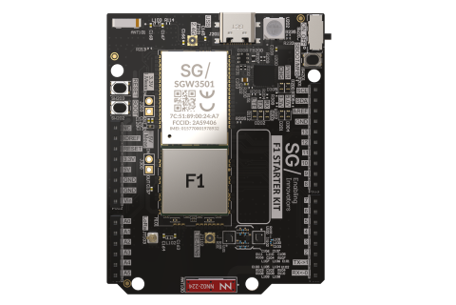

<!------------------------------------------------------------------------------
 ! @copyright Copyright (c) 2023-2024 SG Wireless - All Rights Reserved
 !
 ! Permission is hereby granted, free of charge, to any person obtaining a copy
 ! of this software and associated documentation files(the “Software”), to deal
 ! in the Software without restriction, including without limitation the rights
 ! to use,  copy,  modify,  merge, publish, distribute, sublicense, and/or sell
 ! copies  of  the  Software,  and  to  permit  persons to whom the Software is
 ! furnished to do so, subject to the following conditions:
 !
 ! The above copyright notice and this permission notice shall be included in
 ! all copies or substantial portions of the Software.
 !
 ! THE SOFTWARE IS PROVIDED “AS IS”,  WITHOUT WARRANTY OF ANY KIND,  EXPRESS OR
 ! IMPLIED,  INCLUDING BUT NOT LIMITED TO  THE  WARRANTIES  OF  MERCHANTABILITY
 ! FITNESS FOR A PARTICULAR PURPOSE AND NONINFRINGEMENT.  IN NO EVENT SHALL THE
 ! AUTHORS  OR  COPYRIGHT  HOLDERS  BE  LIABLE FOR ANY CLAIM,  DAMAGES OR OTHER
 ! LIABILITY, WHETHER IN AN ACTION OF CONTRACT, TORT OR OTHERWISE, ARISING FROM,
 ! OUT OF OR IN  CONNECTION WITH  THE SOFTWARE OR  THE USE OR OTHER DEALINGS IN
 ! THE SOFTWARE.
 !
 ! @author  Ahmed Sabry (SG Wireless)
 !
 ! @brief   readme file
 !----------------------------------------------------------------------------->


<!------------------------------------------------------------------------------
 ! Introduction
 !----------------------------------------------------------------------------->
# SGW Firmware SDK

This repository contains the SDK for firmware development for
__SGW OEM Modules and Boards__ such as `F1` product family.
You can start directly building your own multi-connectivity embedded project
from here.




<!------------------------------------------------------------------------------
 ! TOC
 !----------------------------------------------------------------------------->
# Quick References

These are a quick references to contents of the SDK.

* [Getting Started](#get-started)
* [Change Log](CHANGELOG.md)
* SDK Framework
    * [Build System](tools/builder/docs/builder.md)
    * [FW Versioning Structure](src/comps/fw-version/README.md)
* Connectivity Features
    * [LTE-M](src/platforms/F1/comps/lte-poc/lte_main.md)
    * [LoRa](src/comps/lora/docs/lora-main.md)
* F1 Platform Specific Services.
    * [Safeboot](
        src/platforms/F1/bootloader_components/boot-if/docs/safeboot.md)
    * [System Inspection](
        src/platforms/F1/comps/sys-inspect-if/docs/sys_inspect.md)
    * [System Information](src/platforms/F1/comps/sys-info/sysinfo.md)
    * [RGB LED](src/platforms/F1/comps/rgbled-if/rgbled.md)
    * [Fuel Gauge](src/platforms/F1/comps/fuel-gauge-if/fuel_gauge.md)
* Tools.
    * [Tester](tools/tester/docs/readme.md)

<!------------------------------------------------------------------------------
 ! Features
 !----------------------------------------------------------------------------->

# SDK Environment Features

The SDK offers the following features:

*   Multi-connectivity support such as WiFi, BLT, LTE-M and LoRa at both levels
    micropython or C/C++.

*   Easy building; the build system is capable of driving the whole environment
    preparation burdens in a single command such as;
    fetching and downloading the external dependencies, required installations,
    building and image generation and flashing.

*   The feasibility to develop your project either in micropython or in C/C++ or
    both together.

*   A micropython binding layer (a lite interface) to couple/decouple your newly
    developped micropython C modules. By this layer, you can build your own
    component in C language and bind it to the micropython so that the 
    micropython application can utilize it.

*   Generic C-Libraries  such as:
    * Featural logging library, to start easily trace your application.
    * Auto-generation State-machine.
    * Different utilities functionalities.

*   Test engine to build your own test suite and run the existing test suites.

<!------------------------------------------------------------------------------
 ! Getting started
 !----------------------------------------------------------------------------->
<div id="get-started"></div>

# Getting Started

You have F1 based board. Then follow the following steps to get started with
development on F1 platform.

This SDK provides a powerful builder to tackle the firmware building and the
configuration management of the SDK components and underlying externally used
libraries or other platforms.

1. clone the SDK repository
    ```git clone https://github.com/sg-wireless/sg-sdk.git```

2. change directory to the cloned repository ```cd sg-sdk```

3. run the help command to start constituting your target build command
    ```./fw_builder.sh --help```, and you will get the following output or
    similar to it.
    

4. Create a directory for your application development anywhere, and we will
   refer to your application path by ```<user-app-dir>```.

5. Create the basic CMakeLists.txt in your application directory with the
   following contents:
   ```cmake
   __sdk_add_component( user_app_component

        SRCS
            "${CMAKE_CURRENT_LIST_DIR}/*.c"

        MPY_MODS
            "${CMAKE_CURRENT_LIST_DIR}/*.c"

        LOGS_DEFS
            "${CMAKE_CURRENT_LIST_DIR}/*.c"
        
        INCS_PRIV
            # any required includes by your application
        )
    
    __sdk_add_micropython_frozen_manifest(
        # add your micropython manifest files here to be added as a frozen code
        # within micropython building
    )
   ```

6. To build your project application with micropython support for the board
   SGW3501 and having lora and lte feature supported, issue this command:

   ```shell
   ./fw_builder.sh \
        --board SGW3501-F1-StarterKit \ # board F1 StarterKit
        --project-dir <user-app-dir> \  # application directory <user-app-dir>
   ```

   For the first time, the following actions will be carried on by the builder
   and it will take additional time.
   - the 3rd party repository will be cloned specifically the micropython and 
     esp-idf repos.
   - the esp-idf installation procedure will be tackled by the SDK FW builder
   - then start building the whole project.

   To build without micropython support and the whole application development
   will be natively in C language, use the following command

   ```shell
   ./fw_builder.sh \
        --board SGW3501-F1-StarterKit \ # board F1 StarterKit
        --project-dir <user-app-dir> \  # application directory <user-app-dir>
        --variant native                # build only for C application
   ```

7. Connect your development board and start flashing. We will be refering to the
   board usb port by ```<board-port>```. Then issue this command:
   ```shell
   ./fw_builder.sh \
        --board SGW3501-F1-StarterKit \ # board F1 StarterKit
        --project-dir <user-app-dir> \  # application directory <user-app-dir>
        --variant native                # build only for C application
        flash --port <board-port>       # flash to a board port <board-port>
   ```

Now you are ready and your application is running onto the board.


<!--- end of file ------------------------------------------------------------->
